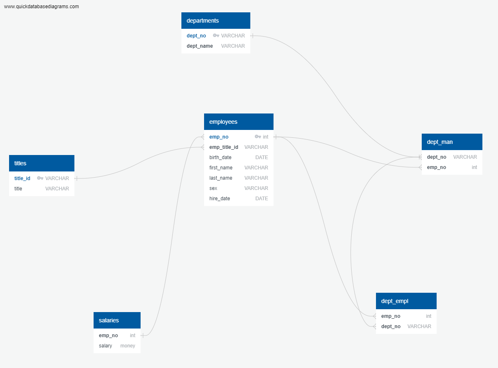
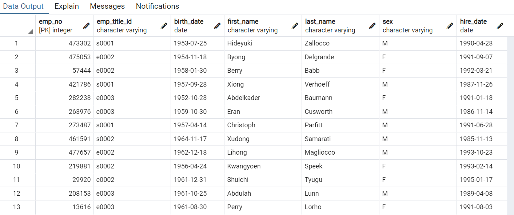

# sql_challenge

## QBD Images

* It is very important to get types for the columns. If done wrong, it will be impossible to populate the tables.

## Creating Table

* I like the drop tables for the sole purpose of fixing troubleshooting the table' structure quickly.
* Drop table IF EXISTS employees

*CREATE TABLE "employees" (
  *  "emp_no" int   NOT NULL,
    * "emp_title_id" VARCHAR   NOT NULL,
    * "birth_date" DATE   NOT NULL,
    * "first_name" VARCHAR   NOT NULL,
    * "last_name" VARCHAR   NOT NULL,
    * "sex" VARCHAR   NOT NULL,
    * "hire_date" DATE   NOT NULL,
    * CONSTRAINT "pk_employees" PRIMARY KEY (
        "emp_no"
  *   )
* );

# DATA Analysis

## Employees Hired on 1986 ASC order

* After seeing the Data. Do a count of the employee
* There 36,150 employees hired on the year 1986. 
