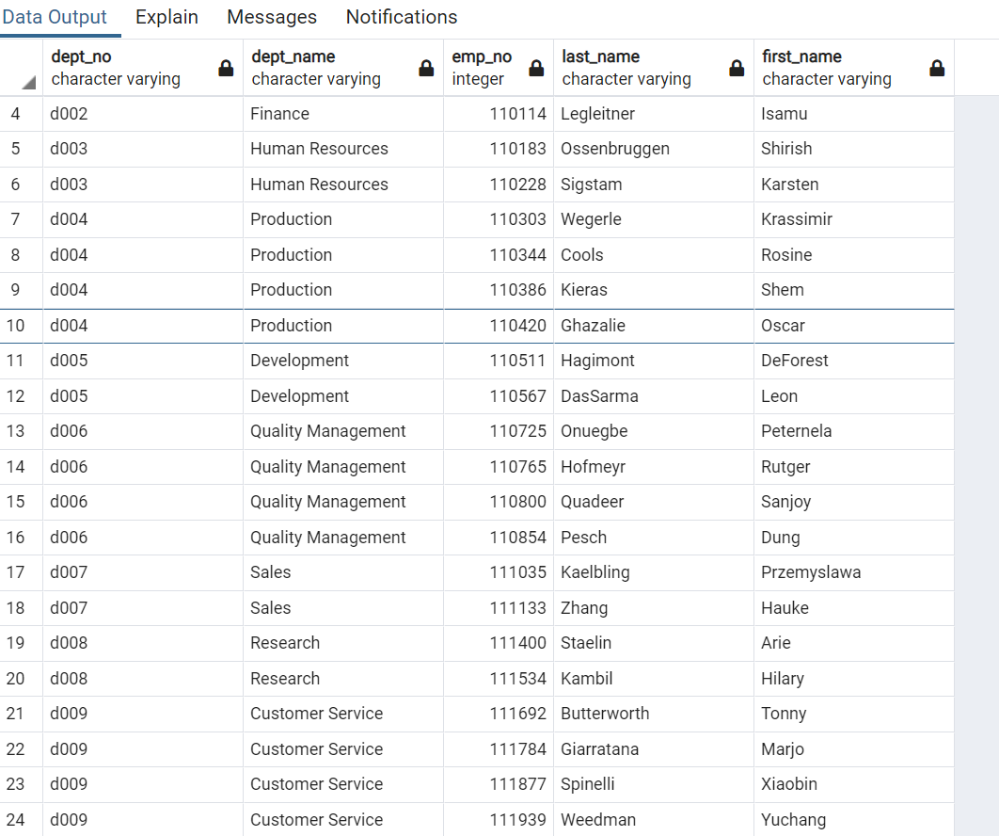
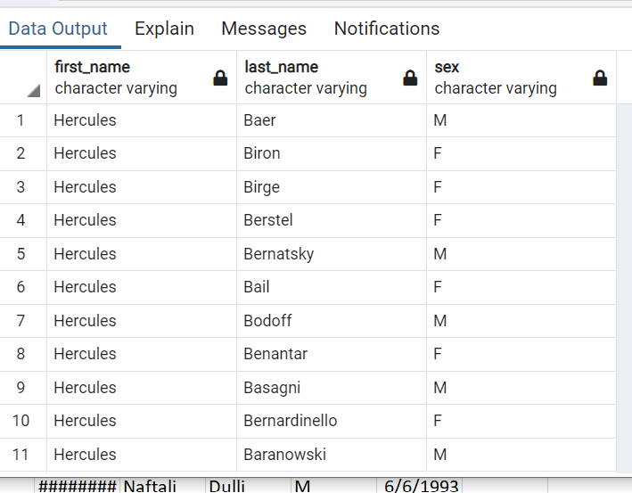
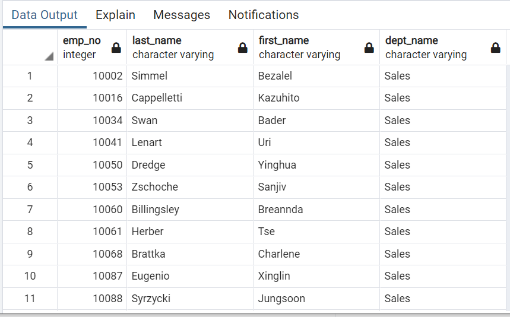
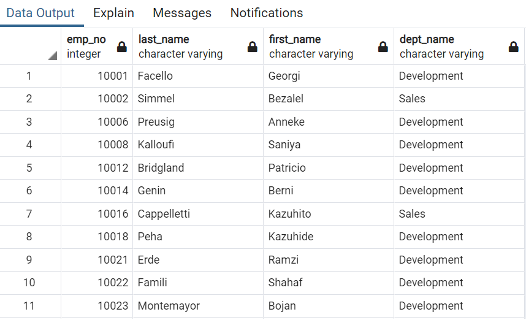
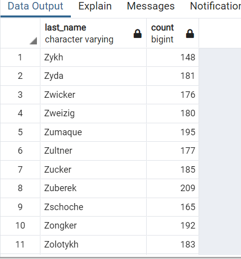

# sql_challenge

## QBD Images

* It is very important to get types for the columns. If done wrong, it will be impossible to populate the tables.

## Creating Table

* I like the drop tables for the sole purpose of fixing troubleshooting the table' structure quickly.
* Drop table IF EXISTS employees
* Sample of the Code

*CREATE TABLE "employees" (
  *  "emp_no" int   NOT NULL,
    * "emp_title_id" VARCHAR   NOT NULL,
    * "birth_date" DATE   NOT NULL,
    * "first_name" VARCHAR   NOT NULL,
    * "last_name" VARCHAR   NOT NULL,
    * "sex" VARCHAR   NOT NULL,
    * "hire_date" DATE   NOT NULL,
    * CONSTRAINT "pk_employees" PRIMARY KEY (
        "emp_no"
    )
); *

# DATA Analysis
* Even though it is not ask. Every Query will be counted. And the count on the readme will  
will only be valid at the creation of the readme. Any futures modification of the tables will need 
the code for the count to be rerun to get a more updated count. 

## Employees Hired on 1986 ASC order

* After seeing the Data. Do a count of the employee
* There 36,150 employees hired on the year 1986. 

## The Departments Managers. 
* This Data is limited because it is historical employees. It doesnt show employee status.

* There 24 Managers

## Hercules
* There are 20 employees with First Name = Hercules, and last name begins with B

## Sales Department Employees
-- There are 52,245 employees

## Sales and Development Department Employees
-- There are 137,952 employees

## Number Employees with Shared Last Names and Frequency of Each Last name 
* There are a total 1,638 last names being shared by all employees 

